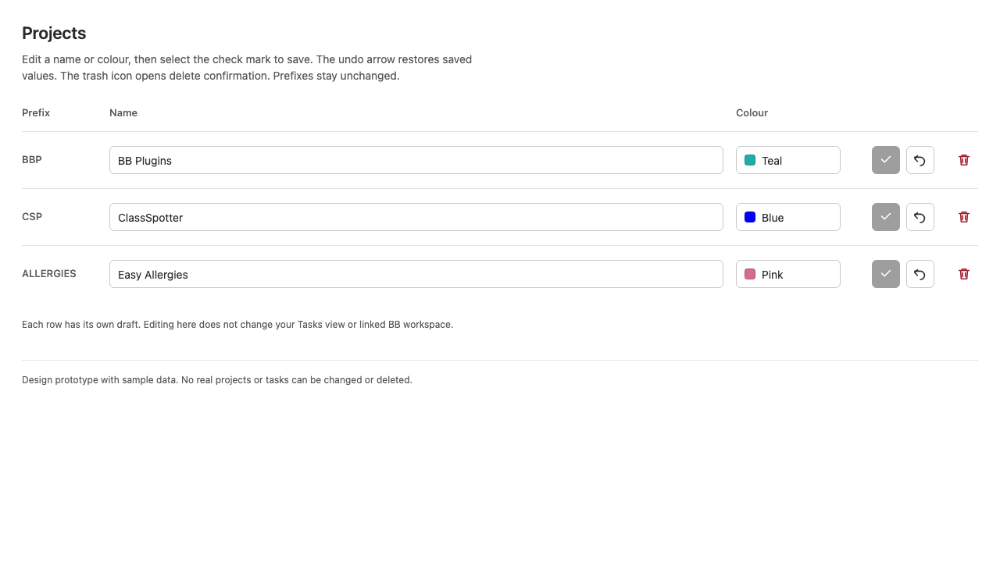
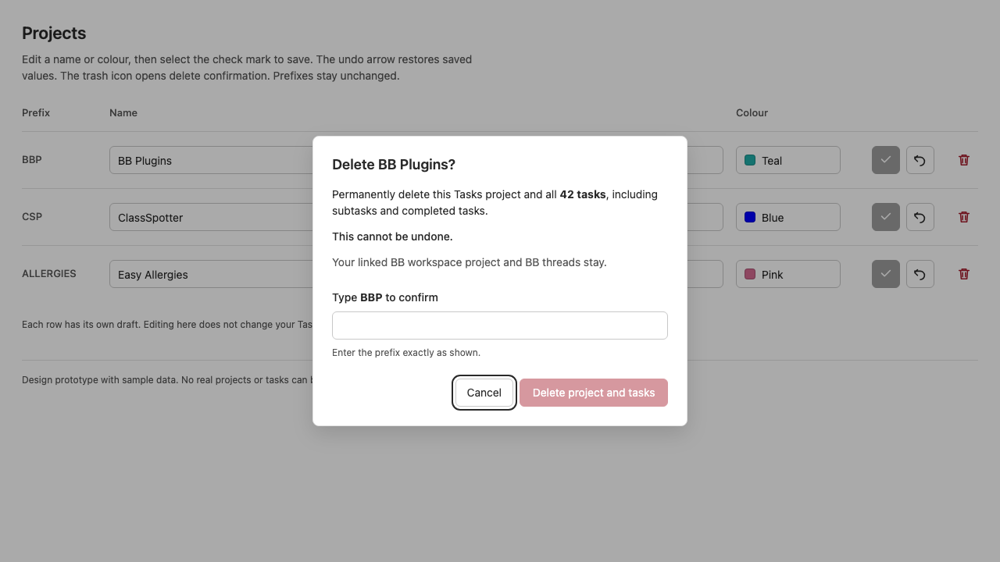
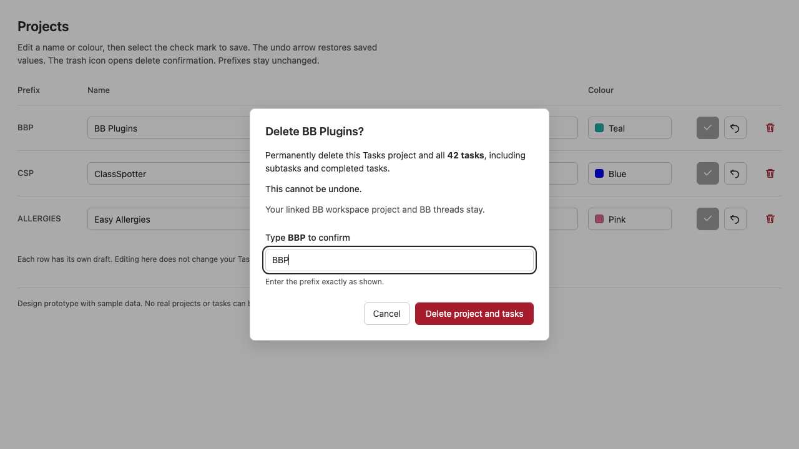

# Design

## Visual prototype

These are browser-captured screenshots of a standalone design prototype, not the implemented Tasks UI. The task counts are sample data. The light-theme colours approximate the documented BB theme; production controls will use the active host tokens. The images record the agreed interaction direction, not final visual acceptance.

[Open the prototype](prototype/project-deletion.html). Row Save and Cancel operate only on sample values. The final delete action reports that no data was deleted. Colour editing, loading/error states and server behaviour are not implemented in this prototype.

### Project row icons

Save uses a check mark, Cancel uses an undo arrow, and Delete uses a separated red trash icon. All three retain full-size click targets, tooltips and accessible names. Save is disabled on unchanged rows.

### Prefix required

The dialog identifies the saved project, shows the sample total of 42 tasks and warns that deletion is permanent. Cancel receives initial focus. The final text-labelled action stays disabled while the prefix field is empty or incorrect.

### Prefix matched

Typing the exact saved prefix, BBP in this example, enables the red Delete project and tasks button. Matching the prefix does not itself submit deletion. Both dialog actions keep their text labels.

## Context

See `proposal.md` for motivation. This design is required because irreversible deletion must share existing mutation and inventory safeguards without losing row drafts.

- `views/manage/projects-section.tsx` keeps identity-bound drafts and a synchronous table-wide save lock. It guards against stale inventories overwriting successful saves.
- `projects-section.css` currently reserves 76px for Save and 64px for the last action. Those text-button rules must change together when adding three icon targets.
- `api/index.ts` already implements `deleteProject`. Its input supports `force: true`; the database cascades task-owned records and the handler removes attachment blobs and publishes `projects:changed`. It does not delete a BB workspace or BB thread.
- `shared/contract.ts` paginates `listTasks`. `shell/data.ts` already has `listAllTasks`, which follows every cursor. `sidebarSummary.taskCount` is an open top-level count, so it cannot supply the deletion total.
- Existing responsive Dialog, Tooltip, Button, Input and Icon components provide the native visual foundation. Component tests and production API/database integration tests already cover project settings. The fixture preview renders the production ProjectsSection.

## Goals / Non-Goals

**Goals:** Keep confirmation local to the project table, reuse the deletion contract, and extend the existing lock and stale-read handling rather than introduce another mutation system. Preserve the accepted name/colour editor.

**Non-Goals:** New database migrations, dependencies, server confirmation tokens, transactional count snapshots, automatic retry, stopping running agents, deleting BB resources, or changing task-browsing navigation rules.

## Decisions

### 1. Reuse the existing deletion RPC

After explicit confirmation, call `deleteProject` with the captured project ID and `force: true`. Validate the returned discriminated result, including `ok: false`; a resolved transport promise is not itself success. A `deleted: false` result means the project is already absent: refresh inventory and report absence rather than claim this request deleted it.

Prefix entry is a UI safeguard, not a new API authorization contract. Adding a required prefix to the existing RPC would change CLI compatibility without meeting another agreed requirement.

### 2. Keep three icon actions in the incumbent table

Use the existing Icon component for check-mark and trash, and its supported undo icon or an undo glyph from the already installed icon package. Keep tooltips and accessible names such as `Save BBP`, `Cancel BBP` and `Delete BBP`. Save remains unavailable when unchanged or invalid. Keep 36px square targets, the established 8px editing-action gap and an extra gap before trash. Use host destructive colour for trash, not a hard-coded red.

Update the heading instructions so Save, Cancel and Delete remain understandable without visible row labels. Keep dialog Cancel and Delete project and tasks text-labelled. Replace text-button-specific and last-child width rules with action-specific fixed sizing. Do not redesign the project table or colour palette.

Alternative: three text buttons. Rejected because the user requested icons and compact rows.

### 3. Bind confirmation to saved identity and reset on opening

Hold the selected project by ID, with saved name and prefix, separately from draft values. A small local dialog component can own prefix input, count loading, deletion error and focus behaviour. It must not own a second project inventory or independent write lock. Keep unsaved row drafts untouched on open, cancellation or failure.

Cancel receives initial focus. The prefix field starts empty each time and uses exact string equality with the saved prefix. No trimming or case folding. The final button is enabled only after counting completes, the prefix matches and the table can begin a mutation for that identity. Do not treat typing a matching prefix as submission.

Before submission, allow Cancel and Escape. During deletion, disable dismissal so closing the modal cannot imply cancellation of an irreversible request. After failure, restore cancellation and manual retry. Use existing responsive overlay behaviour rather than a custom modal system. Restore focus to the trigger on cancellation; on success focus a surviving row action or the Projects heading because the trigger was removed.

### 4. Load a complete count only when confirmation opens

Call `listAllTasks(rpc, { projectId })` without status, active-only or parent filters and count the returned tasks. This reuses the current paginated read interface and includes completed tasks, cancelled tasks and subtasks. Do not fetch totals for every row or reuse the sidebar's filtered count.

Reserve a count/status area while loading. Keep deletion unavailable on count failure and offer manual Retry. Ignore results from a closed dialog or a different selected project. The total is a confirmation-time observation, not a transaction lock; deletion always removes all tasks present when the existing server operation runs.

Alternative: add a count-only RPC. Deferred because the existing helper meets the current acceptance criteria without a new public interface.

### 5. Share mutation exclusion and reconcile confirmed deletion

Extend the table's save lock into a save/delete lock with a project ID and operation kind. Keep its synchronous check, current-inventory readiness check and membership check. The lock owner must survive the same Manage-tab transitions already supported for pending saves.

Disable editing and all row actions during either mutation. Use fixed-size pending icon indicators and a stable dialog action width. Do not reset unrelated drafts. Closing a dialog or changing a selected project must not reuse its pending read or mutation result for another identity.

On `ok: true, deleted: true`, record the deleted identity locally, close the dialog, announce success and omit that row immediately. Continue normal `projects:changed` refresh. Reads that overlap the deletion must not resurrect the removed identity. Keep this reconciliation local to project settings and clear completed read protection only when a newer authoritative inventory confirms absence. A later inventory error remains an inventory error, not a deletion error.

For a deletion error, preserve the selected project and typed prefix, show an alert and release the lock for manual retry. Do not add automatic recovery or rollbacks that the existing API does not promise.

Alternative: wait only for the event-driven inventory response. Rejected because a failed refresh would leave a successfully deleted project visible.

## Risks / Trade-offs

- Permanent data removal. Mitigate with the saved name and prefix, full task count, explicit warning, exact typed prefix and a separate final action.
- Tasks may change after counting. Explain the count as the observed total, keep the warning about all tasks, and use the existing server deletion boundary. A new transactional snapshot is out of scope.
- Counting large projects reads task pages. Load only on dialog opening and reuse pagination. Do not invent count caching or a new endpoint without evidence of a current performance problem.
- Deleting a task record does not stop its BB worker thread. State that BB threads remain; do not issue thread lifecycle actions.
- Replacing action widths can break compact layouts or touch targets. Update the action CSS as one change and check desktop and narrow panels with keyboard focus, light and dark themes.

## Migration Plan

No schema or API migration is needed. Ship the UI through the existing plugin build/install path after tests and visual checks. Reverting the UI removes the entry point but cannot restore projects or tasks that users already deleted. Do not deploy or publish as part of proposal creation.
