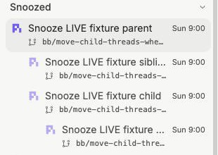

# Verification

## Automated checks

- `npm test` in `bb-plugin-pr-thread-list`: 309 tests passed across 20 files.
- Focused server/store tests: 41 passed.
- `npm run typecheck` and `npm run build`: passed.
- `openspec validate snooze-thread-subtrees --strict`: passed.
- `openspec validate thread-snooze-command-palette --strict`: passed.
- `git diff --check`: passed.
- Simulated both archive orders against the current thread-snooze specification. The final 21 requirement bodies match. Palette additions and subtree modifications do not overwrite the same requirement.

Selector, server, frontend, and rendered-list tests cover captured grandchildren, excluded intermediates, child boundaries, readiness, group wakes, attention tabs, Snoozed nesting, context rows, and existing list preferences. Server restart persistence is covered by the harness. The native deadline schedule was also verified live with no plugin frontend loaded, as recorded below.

## Completion review

One fresh read-only reviewer inspected the full working tree, including untracked files, against `dfcd69bbc5b0fb0b9a40fb184231a19e797d0105`. Its verdict was request changes, with three reproduced findings. No second review was run.

The parent reproduced the failures in regression tests and fixed all three:

1. **Old sweeps modifying replacement read state.** The lifecycle coordinator now serializes read/commit operations and scheduled unread updates. Each unread call also checks captured ownership after lookup. Tests verify final read state, waiting replacements, and manual wake during lookup.
2. **Terminal events lost while hierarchy pages load.** Event capture now starts at action acceptance, before queueing and hierarchy loading. Tests cover completion/failure during loading, signals while queued, outside-subtree events, lifecycle removals during loading, and queue recovery after failure.
3. **Old-version upserts leaving inconsistent group times.** Re-upgrade dissolves groups with inconsistent deadlines or snooze timestamps into singletons, without changing row times or untouched groups. Tests use the baseline upsert against existing grouped members, including an unchanged deadline with a new snooze timestamp.

The server/store regression checkpoint had eight expected failures before implementation. Focused and full verification passed after the fixes. These are parent-resolved findings, not a new clean reviewer verdict.

## Live verification

Task 5.2 passed using an approved, inert parent/child/grandchild/sibling family on the local BB host. Fixture threads were created with placeholders scheduled seven days ahead; each placeholder was deleted immediately. No agent was started and no placeholder was dispatched.

The unmodified worktree plugin was installed with SDK 0.5.29. In the headless browser:

- Parent menu Tomorrow captured all four threads under one group identity and deadline, Sunday October 4 at 09:00.
- After the shared-state refresh, no fixture rows appeared in Needs attention or In flight.
- All showed each fixture once, nested under Snoozed. Parent, children, and grandchild had horizontal offsets of 40, 64, and 88 pixels. Every row's tooltip showed the same deadline. The virtualized list required scrolling to the Snoozed section before inspection.
- Wake now in the child's menu removed all four stored snoozes.
- After focusing the parent composer, palette Snooze until next week captured the same four threads under one identity and Monday October 5 at 09:00. Checks waited for the asynchronous operation and state refresh rather than treating the immediate post-click snapshot as final.

### Controlled attention and terminal signals

A temporary, fixture-scoped test driver outside this repository wrapped the unchanged production server factory. It forwarded native event registrations and exposed only three test methods restricted to the four fixture IDs. Its typecheck and build passed. No driver code or probe RPC remains installed or in the implementation.

- A real pending plugin input interaction on the child, created through `bb.ui.requestInput`, made the open frontend wake all four members. The interaction was inspected as pending and then cancelled. This exercises the shared pending-interaction signal used for approval/answer wakes; no provider command approval was requested.
- Injecting `thread.idle` into the registered production handler on the child removed all four snoozes.
- Injecting `thread.failed` into that handler did the same.

Terminal payloads used the real fixture thread DTOs. These were controlled handler injections, not real agent completions or failures. Native provider event transport was not exercised, since the approved check excluded starting agents.

### Deadline without a frontend

Closed the test browser and temporarily loaded the server with `bb.app` omitted, so no plugin frontend could assist on any connected client. Installed-plugin metadata confirmed `hasApp: false`. Snoozed the group with a deadline of October 3, 2026 at 12:27:37 local time, three seconds after dispatch.

The native minute cron woke all four members about 27.3 seconds after dispatch. Its schedule status was `ok`. No sweep helper was invoked. Every fixture's `lastReadAt` became null while its `latestAttentionAt` remained present, confirming that all four became unread. All group rows were removed.

Approval/answer/unread-error/queued-send detection still requires an open enabled frontend. Completion/failure and deadline sweeps operate on the server without clients.

### Cleanup

Deleted the four fixture threads deepest-first, closed the browser, removed the temporary driver directory, and restored/reloaded the recovered original plugin with its frontend. Compared before/after snapshots: all seven unrelated snooze deadlines were unchanged. Hash checks confirmed that live testing changed no implementation-package source files.

## Installation recovery

The first restoration attempt failed with HTTP 422 because the previous plugin source directory had been deleted:

`/Users/koen/.bb/plugins/environment-git-worktree/host-data/worktrees/thr_s4v2yj8kuq-1/bb-plugins/bb-plugin-pr-thread-list`

With approval, recovered the committed plugin from branch `bb/add-a-running-thread-animation-to-the-sidebar-thr_s4v2yj8kuq` at commit `68712a5509a01844f46a28ebdaeb695d59addfc6`, including its sibling PR navigation helper. All 53 recovered source files match the commit. Uncommitted changes from the deleted directory were not recovered.

The recovered plugin's 263 tests across 18 files, typecheck, and build passed. BB now runs it from:

`/Users/koen/.bb/plugin-recovery/pr-thread-list-68712a5509a0-Z75vtC/bb-plugin-pr-thread-list`

The plugin is enabled and running, its app bundle is compatible with SDK 0.5.29, its summary service runs, and its wake schedule reports success. All seven stored snooze deadlines were unchanged across restoration. Installation moved the local-path source without removing the plugin or resetting its configuration.

This implementation package's files were unchanged by recovery and live testing. The subtree version is no longer the active installation. All 17 tasks are complete. These checks preceded the implementation commit. The OpenSpec change has not been archived.
